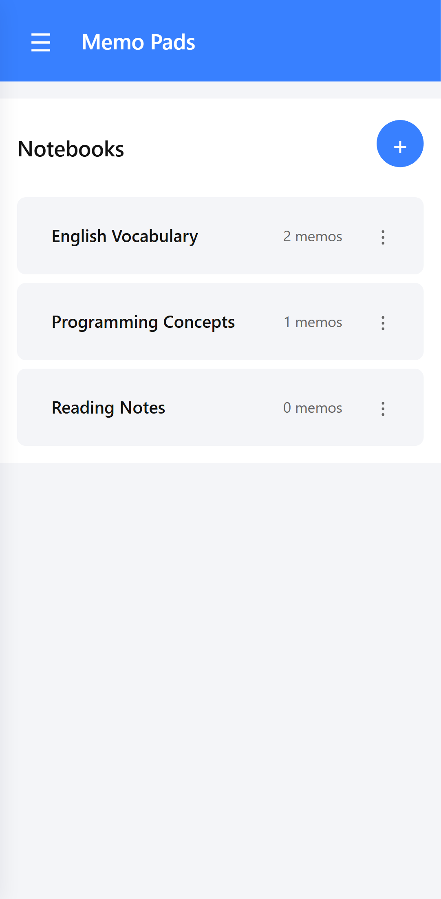
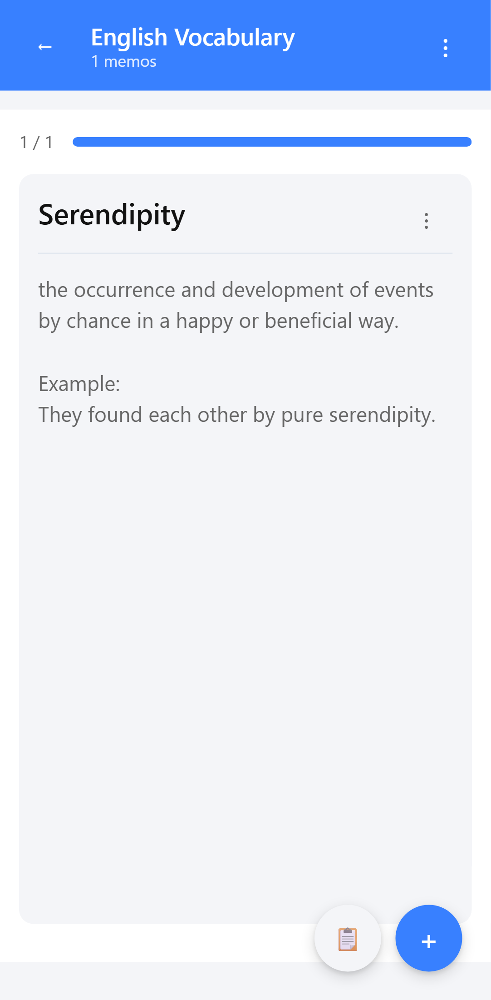
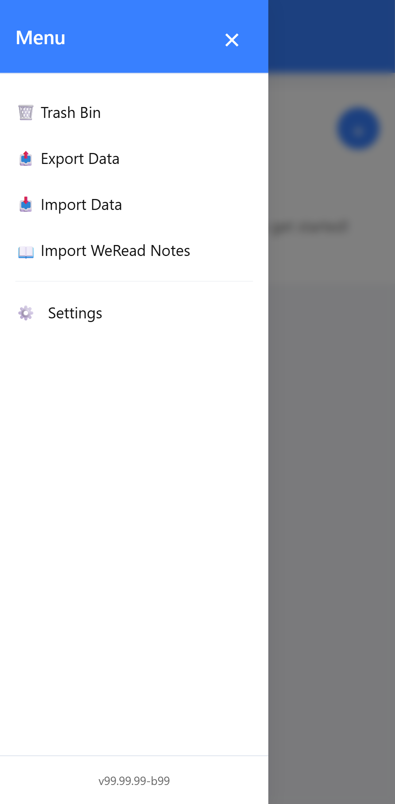
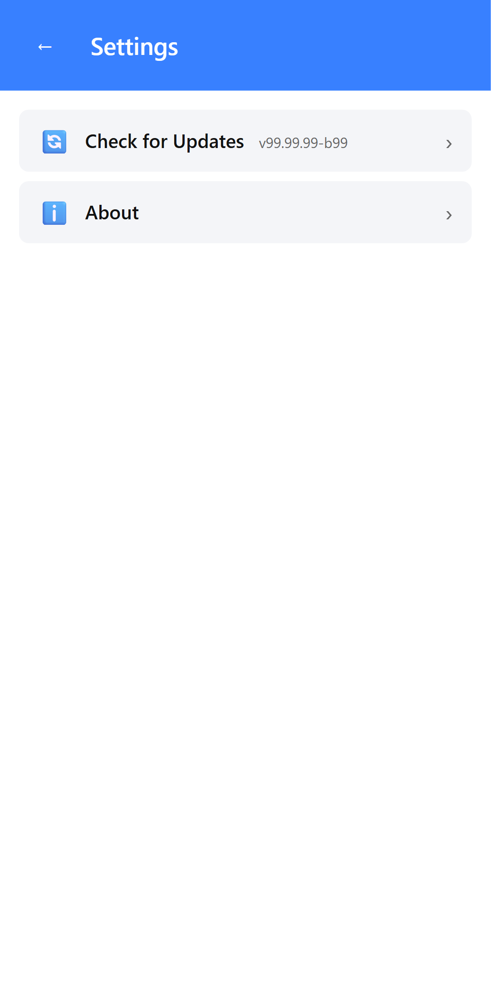

# Memo Pads

A minimalist, highly efficient vocabulary and memo-taking application designed for mobile devices. Built with React and Capacitor, Memo Pads helps you capture fleeting thoughts, save vocabulary words, and import highlights from WeRead directly into organized notebooks.

## ✨ Features

- 📓 **Notebook Organization**: Categorize your memos into different notebooks.
- 👆 **Gesture-Driven Interface**: Swipe left and right to navigate seamlessly between your memos.
- 📋 **Quick Paste**: A dedicated FAB (Floating Action Button) to instantly paste content from your clipboard.
- 📖 **WeRead Integration**: Easily import your exported WeRead highlights and notes.
- 🗑️ **Trash Bin**: Safely recover deleted notebooks and memos, or permanently delete them.
- 🌗 **Dark Mode Support**: Adapts automatically to your system's theme for comfortable reading at night.
- 📦 **Data Portability**: Full support for exporting and importing your data (JSON format).

## 📸 Screenshots

Here is a quick look at the application in action:






## 🚀 Getting Started

### Prerequisites

- Node.js (v18 or higher recommended)
- npm or yarn
- Android Studio (for Android deployment)
- Xcode (for iOS deployment)

### Installation

1. Clone the repository:
   ```bash
   git clone https://github.com/im-red/memo_pads.git
   cd memo_pads
   ```

2. Install dependencies:
   ```bash
   npm install
   ```

3. Start the development server:
   ```bash
   npm run dev
   ```

### Building for Mobile

Sync the web assets to the native platforms:

```bash
npm run build
npm run sync
```

Open in Android Studio or Xcode:

```bash
npm run open:android
# or
npm run open:ios
```

## 🧪 Testing

This project uses [Playwright](https://playwright.dev/) for end-to-end testing, ensuring that both UI geometry and user flows remain stable across updates.

To run the test suite:

```bash
npx playwright test
```

To update the README screenshots (emulating Mobile Chrome):

```bash
npx playwright test tests/screenshots.spec.ts --project="Mobile Chrome"
```

## 📄 License

This project is licensed under the MIT License.
